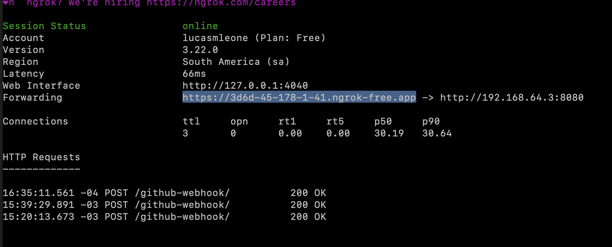

# Jenkins CI/CD para API Node.js con Webhook y Ngrok

Este proyecto implementa un proceso de CI/CD utilizando Jenkins, webhooks de GitHub y una API en Node.js. Se utiliza Ngrok para exponer Jenkins públicamente y permitir que GitHub active automáticamente el proceso de instalación, pruebas y despliegue de la aplicación.

---

## Objetivo

Automatizar el proceso de CI/CD, que incluye la instalación de dependencias, ejecución de pruebas y despliegue de la aplicación cada vez que se realice un **push** o se abra un **pull request** en el repositorio.

---

## Requisitos Previos

- Jenkins en funcionamiento.
- [Ngrok](https://ngrok.com/) instalado.
- Cuenta en GitHub y un fork del repositorio.
- Plugins de Jenkins instalados:
  - GitHub Plugin.
  - NodeJS Plugin.
- Configuración de la herramienta Node.js en Jenkins (en **Tools**). Asegúrese de que el nombre usado (por ejemplo, `nodejs`) coincida con la configuración del pipeline.

---

## Configuración Paso a Paso

### 1. Configurar Node.js en Jenkins

- Acceda a **Manage Jenkins > Tools**.
- En la sección de NodeJS, agregue una nueva instalación.
- Asigne el nombre `nodejs` y seleccione la versión adecuada.

### 2. Fork del Proyecto

- Forquee el repositorio en GitHub.

### 3. Exponer Jenkins con Ngrok

1. Inicie Ngrok para exponer Jenkins en el puerto 8080:
   ```bash
   ngrok http http://<tu-ip>:8080
   ```
   Nota: Reemplace `<tu-ip>` por la dirección correspondiente. La URL generada cambiará cada vez que se inicie Ngrok.

2. Ejemplo de URL generada:
   ```
   https://random.ngrok-free.app/github-webhook/
   ```

### 4. Configurar el Webhook en GitHub

1. Acceda al repositorio forkeado en GitHub.
2. Vaya a **Settings > Webhooks** y haga clic en **Add webhook**.
3. En el campo **Payload URL**, ingrese la URL generada:
   ```
   https://random.ngrok-free.app/github-webhook/
   ```
4. Seleccione **Content type: application/json**.
5. Marque los siguientes eventos:
   - Push

---

## Actualización a Pipeline Multibranch

Inicialmente se usó un pipeline clásico, pero se actualizó a un **Pipeline Multibranch** para detectar automáticamente los cambios en todas las ramas y ejecutar el pipeline en cada **pull request**.

### Configuración

1. Se creó un **Pipeline Multibranch** en Jenkins y se configuró con el repositorio forkeado de GitHub.
2. En el webhook de GitHub, se habilitó la opción para que el trigger notifique a Jenkins cada vez que se cree un nuevo **pull request** en el repositorio.
3. Jenkins ahora detecta automáticamente los cambios en cada rama y ejecuta el pipeline simulando el proceso como si los cambios ya hubieran sido integrados (mergeados).

---

Con esta configuración, se asegura que cada cambio en las ramas o **pull requests** sea probado automáticamente.

## Cómo Probar el Proceso

1. Realice un push o cree un pull request en GitHub para activar el webhook.
2. Jenkins ejecutará automáticamente el proceso de CI/CD.
3. Verifique en la interfaz de Jenkins que el proceso se ejecute correctamente revisando los logs de cada etapa (instalación de dependencias, ejecución de pruebas y despliegue de la aplicación).

---

## Evidencia
- Ngrok funcional

- Delivery history del webhook

- Pull request detectada y probada

- Build del pipeline

- Test del pipeline

- Health check del pipeline


## Diagrama de alto nivel

---
## Notas

- Cada vez que se inicie Ngrok, la URL pública cambiará. Por lo tanto, será necesario actualizar el webhook en GitHub con la nueva URL generada.
- Es importante agregar credenciales al pipeline multibranch, incluso si el repositorio es público, ya que esto aumenta el límite de uso por hora y evita posibles restricciones.
